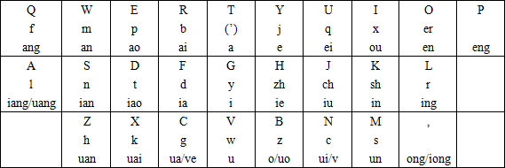
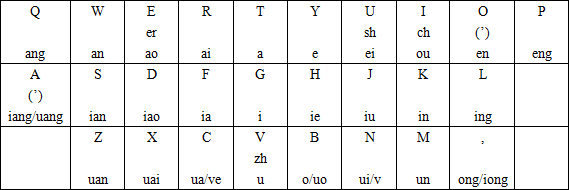

# 屁牌 ahk 拼音脚本系列

目前有屁牌双拼、屁牌原声母双拼、屁牌三拼、注音转拼音。

都提供开关以免妨碍其他操作，注音是 F12，其他是 F2。刚运行时是关闭状态，需要按一次打开。

大部分都考虑了 n+g、n ng 接元音的混淆，自动输出【'】分隔。

关于退格，做起来实在有点蛋疼，只是试验项目，烦请自行按多次。退格会无条件将内部重置为初态（犹见于双拼敲错韵母，请整个音节重来orz）。

手速过快可能导致爆炸，请不要按下两键的时刻过于接近。

## 屁牌双拼键位

## 屁牌原声母双拼键位

许多人表示声母重排太丧病。

## 屁牌三拼

替换【6 7 8 9 0 ;】为【zh ch sh ia wa ng】，所有字母键动作不变。可选【,】表示韵尾n，可以自动与后面的元音、g分隔。

这键位不固定，但是由于 2-3 码变长，大概不太好融入主键盘吧。

## 注音转拼音

按照大千式注音键盘排列，但是由于接入现代拼音，是数字键选字，然而数字键被注音占了。

于是在开启状态下，选字键和数字输入都是 F1 到 F10 平移为 1 到 0。F12开关。

由于现代拼音不用调号，3467 空闲，目前分配【3】为【零声母】，【6 7】为【 ，。】（也被占了）。

零声母为原注音习惯中所无，但是用在ㄓㄔㄕㄖㄗㄘㄙ后有消除歧义作用，需要少许调整习惯。

eㄜ êㄝ 其实并没有区别。

shift 切换中英文依然有效（也就是这样输入数字、-之类的被占的符号）。

# 协议

WTFPL。
