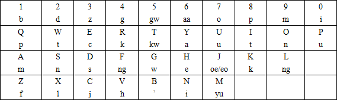

# 屁牌 ahk 拼音脚本系列

目前有屁牌双拼、屁牌原声母双拼、屁牌三拼、注音转拼音。

都提供开关以免妨碍其他操作，注音是 F12，其他是 F2。刚运行时是关闭状态，需要按一次打开。

大部分都考虑了 n+g、n ng 接元音、元音互接的切分混淆，会自动输出【'】分隔。

关于退格，做起来实在有点蛋疼，只是试验项目，烦请自行按多次。退格会无条件将内部重置为初态（尤见于双拼敲错韵母，请整个音节重来orz）。

由于 ahk 本身原因，手速过快可能导致爆炸，请不要瞬间按下两键。

## 屁牌双拼键位

## 屁牌原声母双拼键位

许多人表示声母重排太丧病。

## 屁牌三拼

替换【6 7 8 9 0 ;】为【zh ch sh ia ua ng】，所有字母键动作不变（除了o在jqx后自动变为io）。顺便，【,】表示韵尾形态的 n，可以自动与后面的元音、g分隔。

这键位不固定，但是由于码是变长的，大概不太好融入主键盘吧。

## 注音转拼音

按照大千式注音键盘排列，但是由于接入现代拼音，是数字键选字，然而数字键被注音占了。

于是在开启状态下，选字键和数字输入都是 F1 到 F10 平移为 1 到 0。F12开关。

由于现代拼音不用调号，3467 空闲，目前分配【3】为【零声母】，【6 7】为【，。】（也被占了）。

零声母为原注音习惯中所无，但是用在ㄓㄔㄕㄖㄗㄘㄙ后有消除歧义作用，需要少许调整习惯。

eㄜ êㄝ 在这里其实并没有区别。

Shift 切换中英文依然有效（也就是这样输入数字、-之类的被占的符号）。

## 屁牌粤拼注音转粤拼

仿照大千式注音，脑洞出了用于粤语的四排键分区无冲输入方案。做出来才发现与美式主键盘契合得如此完美，我甚至觉得这货应该已经被发明过无数次了。

开关同上面的注音转拼音。

输入 m, ng 两个鼻音音节时，可以按同样的声母和韵尾，也可以按零声母加韵尾。

内部尽力处理了不输入零声母的情况，不过如果你追求极致无错，还是多按一下吧。

右半键盘的键位现在排列得很简单粗暴，应该可以进一步优化来避免某些常用组合别手。

# 协议

WTFPL。

## 问题

欢迎提 bug、意见与建议，但是太复杂的升级我估计不会做。

ahk 目前似乎只能用于 Windows，如果你能找到折腾到其他系统上的方案，欢迎发教程链接。
